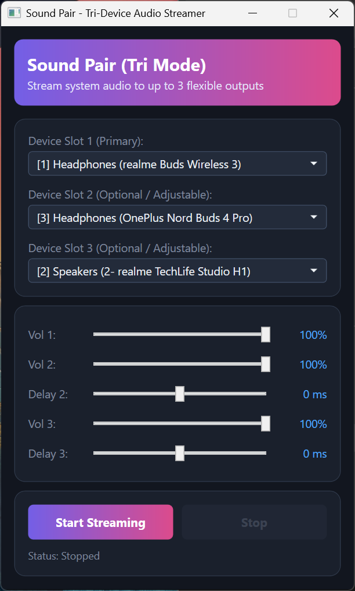

# SoundPair

A modern, lightweight C# Windows Forms application designed to route audio via **VB-Cable** to **three audio devices simultaneously** with millisecond-precision delay synchronization, independent volume controls, and real-time Windows master volume linking.

---

## 📷 App Preview



---

## 🚀 Setup & Quick Start Guide

Follow these simple steps to get SoundPair up and running from scratch:

### Step 1: Install the Virtual Audio Driver

SoundPair requires the **VB-Cable Virtual Audio Driver** to function correctly and isolate your media audio.

- When you launch SoundPair for the first time, if VB-Cable is missing, the app will automatically prompt you to download and open the installer.
- Alternatively, you can download and install it manually from the official [VB-Audio website](https://vb-audio.com/Cable/).
- **Restart the PC**.

### Step 2: Configure Windows Audio Output

1. Open your Windows Sound Settings.
2. Set **CABLE Input (VB-Audio Virtual Cable)** as your default playback device so your media streams cleanly into the application. This ensures unwanted system notification chimes stay silent.

### Step 3: Connect Your Audio Devices

1. Turn on your Bluetooth headsets. SoundPair features automatic hardware detection and will instantly populate them in the dropdown menus (`Device Slot 1 (Primary)`, `Device Slot 2 (Optional / Adjustable)` and `Device Slot 3 (Optional / Adjustable)`).
2. Select your desired base headset and adjustable headset from the lists.

### Step 4: Fine-Tune Delay & Volume

- **Delay Offset:** Use the smooth 0–200ms slider for Headset 2 to eliminate any echo or drift between different headset models.
- **Volume Controls:** Use the independent volume percentage sliders or let it sync in real-time with your Windows master volume mixer and media keys.

### Step 5: Start Streaming

Click the **Start Streaming** button. The app will execute a quick Bluetooth warmup handshake to prevent first-launch desyncs, and live audio will instantly route to both headsets!

---

## ✨ Key Features

- **Tri-Device Streaming:** Route system audio to up to 3 separate playback outputs at the same time.
- **VB-Cable Integration:** Captures audio directly from `CABLE Output`, keeping unwanted system notification chimes and background alerts from leaking into your headsets.
- **Automatic Driver Prompt:** Automatically checks for VB-Cable on launch and offers to download and launch the installer if missing.
- **Dynamic Hardware Detection:** Automatically listens for new Bluetooth device connections and updates dropdown menus in real-time without restarting.
- **Bluetooth Cold-Start Sync Fix:** Features an automated background hardware handshake/warmup sequence that wakes up Bluetooth radio links before streaming, preventing the notorious first-launch desync issue.
- **Millisecond Delay Offset:** Includes a smooth 0–200ms slider to eliminate any echo or drift between different headset models.
- **Independent Volume Controls:** Dedicated volume percentage sliders for Headset 1 and Headset 2.
- **System Volume Synchronization:** Automatically links with your Windows master volume mixer and keyboard media keys in real-time.
- **Modern Dashboard UI:** Inspired by modern dark-mode glassmorphism designs, featuring deep navy card containers, gradient headers, custom rounded panels, and a centralized theme configuration class.

---

## 🛠️ Tech Stack & Requirements

- **Language:** C# 12 / .NET 10 (Windows-specific platform support)
- **UI Framework:** XAML and WPF (Windows Presentation Foundation)
- **Audio Library:** NAudio (v3.x architecture)
- **OS:** Windows 10 / 11 (64-bit)

---

## 📦 How to Build and Publish

You can package this application into single-file executables (`.exe`) using the terminal:

**1. Lightweight Build (Framework-Dependent):**
Tiny file size, requires the target machine to have the .NET 10 runtime installed.

```bash
dotnet publish -c Release -r win-x64 --self-contained false -p:PublishSingleFile=true -p:AssemblyName=Soundpair_lightweight -o ./publish/light
```

**2. Standalone Build (Self-Contained):**
Large file size, does not require the target machine to have the .NET 10 runtime installed

```bash
dotnet publish -c Release -r win-x64 --self-contained true -p:PublishSingleFile=true -p:AssemblyName=SoundPair_standalone -o ./publish/standalone
```
